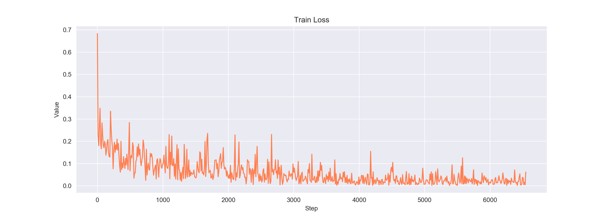
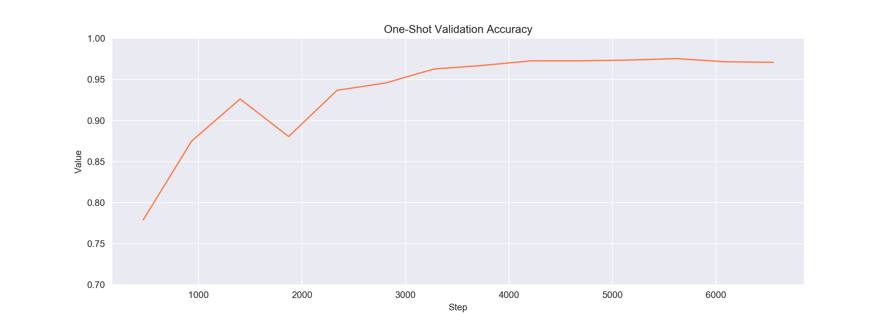

# Siamese Neural Networks for One-shot Image Recognition
An implementation of the [Siamese Neural Networks](https://www.cs.cmu.edu/~rsalakhu/papers/oneshot1.pdf) in PyTorch, trained and tested on the [MNIST](http://yann.lecun.com/exdb/mnist/) dataset.

## Requirements
* torchvision==0.5.0
* torch==1.4.0
* numpy==1.16.3
* pytorch_lightning==0.5.3.2
* Pillow==7.0.0

*requirements.txt* is provided

## Instructions

This project uses [PyTorch Lightning](https://github.com/PyTorchLightning/pytorch-lightning) which is a lightweight wrapper on PyTorch. This project follows the [LightningModule](https://github.com/PytorchLightning/pytorch-lightning#how-do-i-do-use-it) format. 

Simply running cpu_run.py or gpu_run.py downloads the MNIST dataset and starts training.

## Results
Highest 10-way one-shot accuracy on the held-out test set is 97.5% which is comparable to supervised classification models.
Support set is manually picked.

### References
* [Siamese Neural Networks for One-shot Image Recognition](https://www.cs.cmu.edu/~rsalakhu/papers/oneshot1.pdf)
* [One Shot Learning and Siamese Networks in Keras](https://sorenbouma.github.io/blog/oneshot/)
* [One Shot Learning with Siamese Networks using Keras](https://towardsdatascience.com/one-shot-learning-with-siamese-networks-using-keras-17f34e75bb3d)
* [siamese-pytorch](https://github.com/fangpin/siamese-pytorch)
